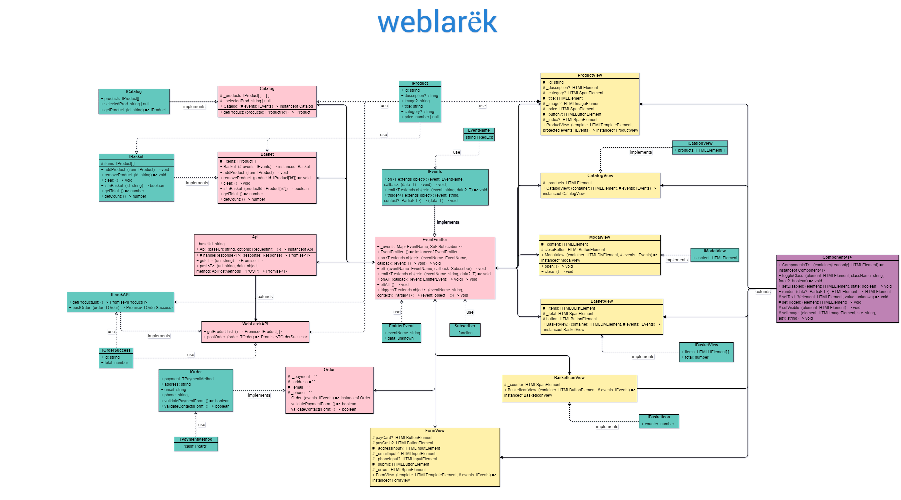

https://github.com/leadenrain/web-larek-frontend.git

# Проектная работа "Веб-ларек"

Стек: HTML, SCSS, TS, Webpack

Структура проекта:
- src/ — исходные файлы проекта
- src/components/ — папка с JS компонентами
- src/components/base/ — папка с базовым кодом

Важные файлы:
- src/pages/index.html — HTML-файл главной страницы
- src/types/index.ts — файл с типами
- src/index.ts — точка входа приложения
- src/sccs/styles.scss — корневой файл стилей
- src/utils/constants.ts — файл с константами
- src/utils/utils.ts — файл с утилитами

## Установка и запуск
Для установки и запуска проекта необходимо выполнить команды

```
npm install
npm run start
```

или

```
yarn
yarn start
```
## Сборка

```
npm run build
```

или

```
yarn build
```

## Данные и типы данных, используемые в приложении

**IProduct**

Интерфейс описывает типы данных товара:
- `id: string` - идентификатор
- `description: string` - описание
- `image: string` - изображение
- `title: string` - название
- `category: string` - категория
- `price: number | null` - цена

**ICatalog**

Интерфейс для типизации каталога товаров:
- `products: TProduct[]` - массив товаров
- `selectedProd: string | null` - выбранный товар
- `getProduct: (id: string) => TProduct` - метод получения товара по его id

**IOrder**

Интерфейс для типизации данных заказа :
- `payment: TPaymentMethod` - способ оплаты заказа 
- `address: string` - адрес доставки
- `email: string` - электронная почта
- `phone: string` - номер телефона
- `validatePaymentForm: () => boolean` - валидация 1 шага заказа
- `validateContactsForm: () => boolean` - валидация 2 шага заказа

**IBasket**  

Интерфейс типизирует данные корзины:
- `items: IProduct[]` - список товаров
- `addProduct: (item: IProduct) => void` - добавление товара в корзину
- `removeProduct: (id: string) => void` - удаление товара из корзины
- `clear: () => void` - очищение корзины
- `isInBasket: (id: string) => boolean` - проверка наличия конкретного товара в корзине
- `getTotal: () => number` - полуение общей уммы корзины
- `getCount: () => number` - получение количества товаров в корзине

**IEvents**

Интерфейс описывает методы работы с событиями:
- `on<T extends object>: (event: EventName, callback: (data: T) => void) => void` - устанавливает обработчик на событие
- `emit<T extends object>: (event: string, data?: T) => void` - инициирует событие с данными
- `trigger<T extends object>: (event: string, context?: Partial<T>): (data: T) => void` - создает триггер, генерирующий событие при вызове

**ILarekAPI**

Интерфейс описывает методы получения данных с сервера
- `getProductList: () => Promise<IProduct[]>` - получение промиса с массивом товаров
- `postOrder: (order: TOrder) => Promise<TOrderSuccess>` - отправляет указанный заказ на сервер, возвращая промис с результатом

**Данные пользователя в форме заказа**

- `TPaymentMethod = 'cash' | 'card'` - тип для выбора способа оплаты
- `TOrderPayment = Pick<IOrder, 'payment' | 'address'>` - тип для формы с выбором оплаты и адресом
- `TOrderContacts = Pick<IOrder, 'email' | 'phone'>` - тип для формы с почтой и телефоном
- `TOrderErrors<T> = Partial<Record<keyof T, string>>` - тип ошибок валидации форм

**Данные для работы с сервером**

- `ApiListResponse<T> = { total: number; items: T[]};` - тип получения данных
- `ApiPostMethods = 'POST' | 'PUT' | 'DELETE'` - используемые HTTP-методы
- `TOrder = TOrderPayment & TOrderContacts & ApiListResponse<TProduct>` - тип сформированного заказа для отправки на сервер
- `TOrderSuccess = { id: string; total: number }` - тип успешного заказа

## Архитектура приложения

Код приложения разделен на слои согласно парадигме **MVP**: 
- *слой представления*. Отвечает за отображение данных на странице, 
- *слой данных*. Отвечает за хранение и изменение данных
- *презентер*. Отвечает за связь представления и данных.

Все свойства классов прописаны защищенными, что обеспечивает доступ к некоторым данным или функциональности только внутри класса и его наследников, но не извне. Это помогает инкапсулировать внутреннюю логику класса и предотвратить несанкционированный доступ к его внутренним данным.

### Базовый код

#### Класс Api
Содержит в себе базовую логику отправки запросов. 
- `constructor(baseUrl: string, options: RequestInit = {})` - конструктор, используя переданные аргументы, инициирует свойства `baseUrl`(базовый адрес сервера) и `options`(глобальные настройки запросов) экземпляра класса.
Методы: 
- `handleResponse<T>: (response: Response) => Promise<T>` - обрабатывает ответ сервера, возвращая промис с объектом ответа
- `get<T>(uri: string) => Promise<T>` - выполняет GET запрос на переданный в параметрах ендпоинт и возвращает промис с объектом, которым ответил сервер
- `post<T>(uri: string, data: object, method: ApiPostMethods = 'POST') => Promise<T>` - принимает объект с данными, которые будут переданы в JSON в теле запроса, и отправляет эти данные на ендпоинт переданный как параметр при вызове метода. По умолчанию выполняется `POST` запрос, но метод запроса может быть переопределен заданием третьего параметра при вызове.

#### Класс EventEmitter
Брокер событий позволяет отправлять события и подписываться на события, происходящие в системе. Класс используется в презентере для обработки событий и в слоях приложения для генерации событий.  
- `_events: Map<EventName, Set<Subscriber>>` - структура данных, которая состоит из пар ключ-значение, где ключ (EventName) представляет собой имя события, а значение (Set<Subscriber>) - набор подписчиков, которые хотят получать уведомления об этом событии.
Методы, реализуемые классом, описаны интерфейсом `IEvents`:
- `on` - установка обработчика на событие
- `emit` - инициация события
- `trigger` - возвращает функцию, при вызове которой инициируется требуемое в параметрах событие   
Добавлены методы:
- `off: (eventName: EventName, callback: Subscriber) => void` - снятие обработчика с события
- `onAll: (callback: (event: EmitterEvent) => void) => void` - слушать все события
- `offAll: () => void` - сбросить все обработчики

#### Класс Component<T>
Абстрактный класс для создания компонентов разметки. В дженерик принимает тип объекта, в котором данные будут передаваться в метод render для отображения данных в компоненте. В конструктор - контейнер с типом HTMLElement.
Содержит набор часто используемых в слое отображения методов:
- `toggleClass: (element: HTMLElement, className: string, force?: boolean) => void` - переключение указанного класса
- `setText: (element: HTMLElement, value: unknown) => void` - установка указанного текстового содержимого в HTML-элемент
- `setDisabled: (element: HTMLElement, state: boolean) => void` - установка блокировки элемента
- `setHidden: (element: HTMLElement) => void` - скрытие указанного элемента
- `setVisible: (element: HTMLElement) => void` - возврат элементу видимости настранице
- `setImage: (element: HTMLImageElement, src: string, alt?: string) => void` - установка изображения с альтернативным текстом
- `render: (data?: Partial<T>) => HTMLElement` - получение корневого DOM-элемента. Отвечает за сохранение полученных в параметре данных в полях компонентов через их сеттеры.

### Слой данных

*Все классы слоя данных в конструктор получают экземпляр брокера событий.*

#### Класс WebLarekAPI
Класс расширяет базовый класс Api, реализуя интефейс ILarekAPI. Предназначен для работы с сервером приложения с помощью следующих методов:
- `getProductList: () => Promise<IProduct[]>` - выполняет запрос для получения каталога товаров, соответствующих интерфейсу IProduct
- `postOrder: (order: TOrder) => Promise<TOrderSuccess>` - отправляет сформированный заказ на сервер, возвращая результат операции

#### Класс Catalog
Класс для работы с каталогом товаров. Реализует интерфейс ICatalog, предоставляя метод получения товара по id и сеттеры для размещения каталога и выбранного товара. 
Свойства класса:
- `_products: IProduct[] = []` - каталог товаров в виде массива
- `_selectedProd: string | null` - идентификатор товара
- `getProduct: (id: string) => TProduct` - получение товара по его id
- `set products(products: IProduct[])` - располагает товары в каталоге
- `set selectedProd(productId: string | null)` - устанавливает id выбранному товару

#### Класс Basket
Класс описывает логику работы с корзиной. Свойства и методы:
- `_items: IProduct[] = []` - массив товаров
- `addProduct: (item: IProduct) => void` - добавление товара в корзину
- `removeProduct(productId: IProduct['id'])` - удаление товара из корзины
- `clear: () => void` - очищение корзины
- `isInBasket: (id: string) => boolean` - проверка наличия конкретного товара в корзине
- `getTotal: () => number` - получение общей суммы товаров
- `getCount: () => number` - получение количества товаров
- `get items` - получает массив товаров

#### Класс Order
Класс для работы с вводимыми пользователем данными, реализует интерфейс IOrder. Свойства и методы класса:
- `_payment = 'card'` - выбор способа оплаты заказа (по умолчанию - card)
- `_address = ''` - адрес доставки
- `_email = ''` - электронная почта
- `_phone = ''` - номер телефона
- `validatePaymentForm()` - осуществляет валидацию полей формы первого шага заказа
- `validateContactsForm()` - осуществляет валидацию полей формы второго шага заказа
- `set payment(method: TPaymentMethod)` - устанавливает значение в поле 'payment'
- `set address(value: string)` - устанавливает значение в поле 'address'
- `set email(value: string)` - устанавливает значение в поле 'email'
- `set phone(value: string)` - устанавливает значение в поле 'phone'

### Слой представления

*Все классы представления отвечают за отображение внутри DOM-элемента передаваемых в него данных. Наследуются от базового класса Component<T>, используя его конструктор(принимает HTML-контейнер для расположения дочерних элементов) и методы. Так же в конструктор классы принимают экземпляр брокера событий.*

#### ProductView
Класс для 'отрисовки' карточки товара. В конструктор принимает шаблонный элемент. Шаблон используется для различного отображения одного и того же товара в разных частях приложения. 
Свойства класса представляют собой элементы разметки:
- `_id: string` - идентификатор товара (только для хранения, на странице не отображается)
- `_description?: HTMLElement` - описание товара 
- `_category?: HTMLSpanElement` - категория товара 
- `_title: HTMLElement` - название товара 
- `_image?: HTMLImageElement` - изображение товара 
- `_price: HTMLSpanElement` - стоимость товара 
- `_button?: HTMLButtonElement` - кнопка для добавления/удаления товара из корзины
- `_index?: HTMLSpanElement` - порядковый номер товара в корзине 
- `get id()` - получение id товара
- `set id(id)` - установка значения в поле 'id'
- `set description(value: string)` - установка значения в поле 'description'
- `get category()` - получение класса категории товара
- `set category(value: string)` - установка значения в поле 'category'
- `set title(value: string)` - установка значения в поле 'title'
- `set image(value: string)` - установка значения в поле 'image'
- `set price(value: number)` - установка значения в поле 'price'
- `set button(value: string)` - установка значения в поле 'button'
- `set index(value: number)`- установка значения в поле 'index'

В зависимости от вида карточки товара установлены слушатели клика на сам товар для передачи данных через событие в модальное окно, и кнопку удаления из корзины.

#### FormView
Класс для отображения форм заказа на странице. Так как в приложении форма заказа разбита на 2 части, использует шаблонный элемент, чтобы избежать дублирования кода. Свойства класса:
- `payCard?: HTMLButtonElement` - оплата картой 
- `payCash?: HTMLButtonElement`- оплата наличными 
- `_addressInput?: HTMLInputElement` - адрес доставки 
- `_emailInput?: HTMLInputElement`- электронная почта 
- `_phoneInput?: HTMLInputElement` - номер телефона 
- `_submit: HTMLButtonElement` - кнопка отправки данных заблокирована по умолчанию
- `_errors: HTMLSpanElement` - ошибки валидации 
- `set submit(state: boolean)` - установка значение в поле 'submit'
- `set errors(value: string)` - установка значение в поле 'errors'
- `set payment(value: TPaymentMethod)` - установка значение в поле 'payment'
- `set address(value: string)` - установка значение в поле 'address'
- `set email(value: string)` - установка значение в поле 'email'
- `set phone(value: string)` - установка значение в поле 'phone'
Во время заполнения полей формы в брокер передается событие с данными этих полей для проверки на валидность и получения текста ошибки, если она есть. Текст ошибки передается через событие на 'отрисовку'. При успешном заполнении формы активируется кнопка, при клике на которую введенные данные передаются в событие для дальнейшего сохранения и перехода к следующему шагу заказа.

#### ModalView
Класс реализует модальное окно. Т.к. используется только 1 модальное окно, а содержимое меняется, в классе указано свойство `_content`. Какой контент устанавливается, зависит от события, принятого брокером. 
- `closeButton: HTMLButtonElement` - кнопка закрытия модального окна
- `_content: HTMLElement` - контент модального окна
- `set content(content: HTMLElement)` - установка контента в модальное окно
- `open()` - открытие модального окна
- `close()` - закрытие модального окна
Установлены слушатели клика по кнопке закрытия модального окна и оверлею.

#### BasketView
Класс отображает корзину пользователя:
- `_items: HTMLUListElement`- список товаров 
- `_total: HTMLSpanElement`- общая стоимость товаров 
- `button: HTMLButtonElement`- кнопка перехода к оформлению заказа 
- `set items(items: HTMLLIElement[])` - располагает товары в список
- `set total(value: number)` - выводит общую стоимость товаров
Установлен слушатель клика на кнопку оформления заказа. По клику данные корзины передаются в событие, брокер инициирует передачу контента(формы заказа) в модальное окно.

#### Другое
- `CatalogView` отвечает за вывод каталога товаров на страницу. Для установки товаров есть сеттер: `set catalog(products: HTMLElement[])` .
- `BasketIconView` - изображение корзины в шапке страницы. Показывает счетчик товаров с помощью сеттера: `set counter(value: number)`.

## Взаимодействие компонентов
В файле index.ts распложен код, по сути выполняющий роль презентера. Он описывает взаимодействие между слоями данных и представления за счет генерируемых брокером событий и обработчиков этих событий. Это взаимодействие наглядно представлено на UML-диаграмме.

### Список событий в приложении:


| Событие             | Триггер                     | Реакция                 |
|:--------------------|:----------------------------|:------------------------|
| catalog: change|загрузка каталога товаров| вывод на экран карточек товаров, установка слушателей |
| product: select|клик по карточке товара|получение id товара, установка значения в поле модели|
| preview: change|получение id |проверка id на наличие в корзине, передача темплейта превью товара в модальное окно |
|basket change: add|клик по кнопке добавления товара|получение данных, установка значений в поля модели,передача в модальное окно темплейтов: карточка товара в корзине, корзина, установка счетчика и слушателя на иконку корзины, активация иконки| 
|basket change: remove| клик по кнопке удаления товара|получение данных, установка новых значений в поля модели, вывод нового изображения корзины|
|basket change: clear |удаление последнего товара из корзины| удаление счетчика и слушателя на иконку корзины, деактивация иконки|
|order: change|клик по кнопке оформления заказа|сохранение данных корзины, передача в модальное окно темплейта формы первого шага оформления заказа|
|form change: \<field>|изменение вводимых пользователем данных| валидация, передача ошибок(если есть), установка значения в поле модели, активация кнопки перехода к следующему шагу оформления заказа|
|form error: \<field>|получение ошибки| вывод текста ошибки на экран|
|form: submit|нажатие кнопки| сохранение данных формы, передача в модальное окно темплейта формы следующего шага оформления заказа|
|order: ready| клик по кнопке оплаты заказа| передача данных заказа на сервер, передача в модальное окно темплейта с сообщением|
|order: success|клик по кнопке|очищает заполненные пользователем данные и корзину|
|modal open: \<content>|получение темплейта контента|вывод на экран модального окна с соответствующим  контентом, установка слушателей|
|modal close: \<content>|клик по кнопке закрытия модального окна или оверлею|удаление контента из модального окна, закрытие|


### Взаимодействия между слоями приложения: 




В файле index.ts созданы экземпляры всех необходимых классов и настроена обработка событий.